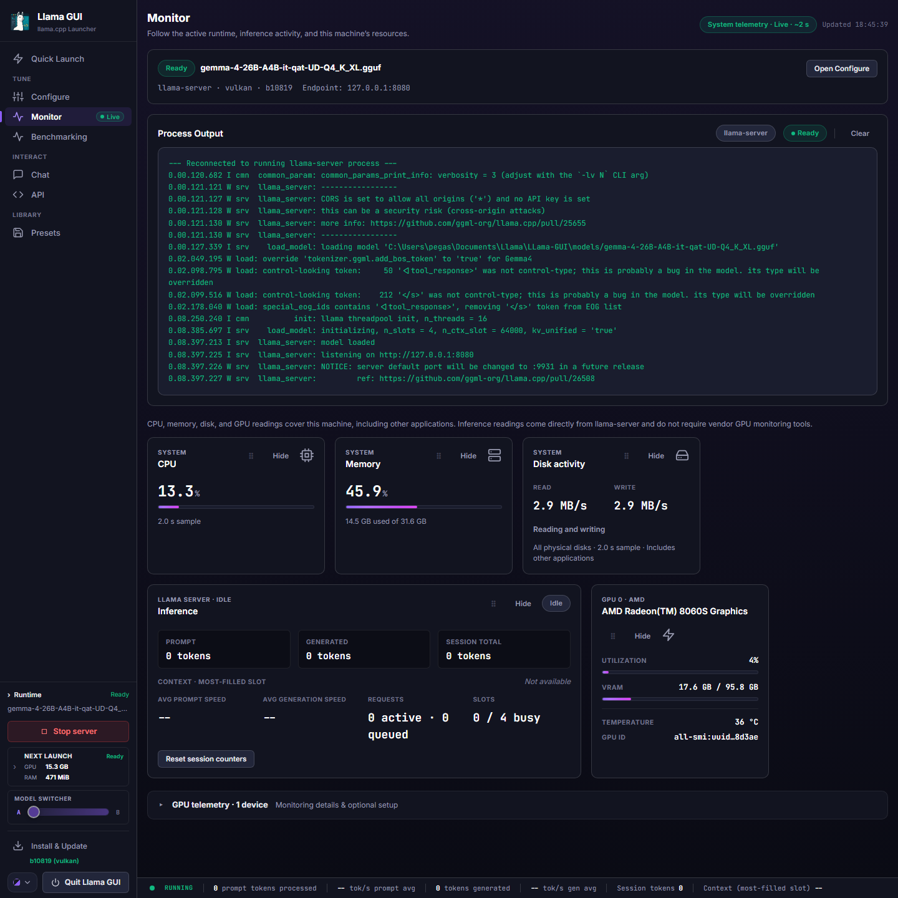

<h1 align="center">Llama GUI</h1>

<p align="center">
  
</p>

<!-- readme-badges:start -->
<div align="center">

[](https://github.com/thomas9120/LLama-GUI/releases/latest) [](https://github.com/thomas9120/LLama-GUI/blob/main/LICENSE) [](#quick-start) [](#quick-start) [](#quick-start) [](#requirements)

</div>
<!-- readme-badges:end -->

<p align="center">
  <a href="https://www.buymeacoffee.com/thomas9120">
    
  </a>
</p>

<br><br>

Lightweight local launcher and control panel for `llama.cpp` on Windows, macOS, and Linux.

Llama GUI provides a browser UI to:
- install prebuilt `llama.cpp` releases by backend (CPU/CUDA/Vulkan/SYCL/ROCm; Lemonade ROCm on supported AMD targets)
- launch `llama-server` or `llama-cli` from beginner **Quick Launch** or full **Configure**
- chat with streaming Markdown, Focus mode, collapsed reasoning, and optional zero-key web search
- benchmark with `llama-bench` / `llama-perplexity`, monitor live stats, and use OpenAI-compatible API snippets
- manage launch presets, keep two server presets on configuration standby for quick switching, create Windows preset shortcuts, and run in-app GitHub updates
- pick from five themes — **Tokyo** and **Nebula** (dark), **Graphite** (mid-tone), **Cappuccino** and **Mint** (light) — all meeting WCAG AA contrast

Special thanks to ggml-org for [llama.cpp](https://github.com/ggml-org/llama.cpp).

## Contents

- [Requirements](#requirements)
- [Quick Start](#quick-start)
- [Install With Pinokio](#install-with-pinokio)
- [Screenshots](#screenshots)
- [Getting Models](#getting-models)
- [First Run](#first-run)
- [Advanced Access](#advanced-access)
- [What Each Tab Does](#what-each-tab-does)
- [GPU Monitoring Setup](docs/gpu-monitoring.md)
- [Presets and Samplers](#presets-and-samplers)
- [Maintenance](docs/maintenance.md)
- [Data Locations](#data-locations)
- [Troubleshooting](docs/troubleshooting.md)
- [Security Notes](docs/security.md)

## Requirements

- Python 3.9+, `pip`, and virtual environment support (`python -m venv`)
- Internet access for release downloads, optional app updates, and optional Chat web search
- A supported OS/architecture for the prebuilt `llama.cpp` binaries you want

Supported prebuilt backends (installer only offers matches for your OS/arch):
- Windows: CPU, CUDA, Vulkan, SYCL, ROCm, and more
- macOS: Apple Silicon (`Metal`) and Intel CPU
- Linux: CPU, Vulkan, ROCm, OpenVINO, Lemonade ROCm (depends on architecture; some accelerators need vendor drivers)

## Quick Start

### One-command install

macOS/Linux:

```bash
curl -fsSL https://raw.githubusercontent.com/thomas9120/LLama-GUI/main/online_installers/install-online.sh | sh
```

Windows PowerShell:

```powershell
irm https://raw.githubusercontent.com/thomas9120/LLama-GUI/main/online_installers/install-online.ps1 | iex
```

The online installer clones into `~/LLama-GUI` (macOS/Linux) or `%USERPROFILE%\LLama-GUI` (Windows), installs dependencies, and starts the app. Set `LLAMA_GUI_INSTALL_DIR` for a custom path, or `LLAMA_GUI_NO_START=1` to install without starting. On Windows it also creates a **Llama GUI** desktop shortcut.

### Manual install

```bash
git clone https://github.com/thomas9120/LLama-GUI.git
cd LLama-GUI
```

Install dependencies:
- macOS/Linux: `./install.sh`
- Windows: `windows_install.bat`

If macOS/Linux reports `permission denied`, restore the executable bit:

```bash
chmod +x install.sh mac_linux_start.sh mac_linux_silent_start.sh
```

Start the app:
- Windows: desktop shortcut, `windows_start.bat`, or `windows_startsilent.bat`
- macOS/Linux: `./mac_linux_start.sh` or `./mac_linux_silent_start.sh`

Open `http://127.0.0.1:5240`. In **Install**, choose a version + backend and click **Install**. Add models (see [Getting Models](#getting-models)), launch from **Quick Launch**, then use **Chat** or **Configure** as needed.

To recreate the Windows desktop shortcut without reinstalling:

```powershell
powershell -NoProfile -ExecutionPolicy Bypass -File .\scripts\create_windows_shortcuts.ps1 -ShortcutsOnly
```

To build CUDA `llama.cpp` yourself on Linux, see `Linux_compile_toolkit/`.

## Install With Pinokio

If you use [Pinokio](https://pinokio.computer/), install via [thomas9120/llama-gui-pinokio](https://github.com/thomas9120/llama-gui-pinokio). The Pinokio launcher starts Llama GUI; the in-app **Install** tab still manages `llama.cpp` backends, models, presets, and launches.

## Screenshots

| Quick Launch | Configure |
| --- | --- |
|  |  |

| Chat | API |
| --- | --- |
|  |  |

| Install | Presets |
| --- | --- |
|  |  |

| Monitor |
| --- |
|  |

## Getting Models

Place `llama.cpp`-compatible `.gguf` files in `models/` or any subfolder under it (or use **Open Models**). To use an existing library elsewhere, open **Configure → Models Folder → Change…** and select that folder; **Reset to default** returns to `models/`. The active folder's models appear in **Quick Launch** and **Configure**. Vision projector filenames are excluded from the launch-model list; the legacy `models/mmproj/` folder remains excluded too.

Or download in-app from **Quick Launch**:
1. Enter a Hugging Face repo ID such as `owner/model-GGUF`.
2. Click **Find GGUF Files**, pick a file, then **Download**.

Downloads land under `<active models folder>/<owner_repo>/` (repo id with `/` → `_`). For vision/multimodal models, also download the matching `mmproj` file when the repo provides one. The projector lands beside its model in the same folder, and the Multimodal Projector setting is applied automatically.

## First Run

1. Install a backend in **Install** and confirm the badge shows an installed version (not `Not Installed`).
2. Add at least one `.gguf` to `models/`, or select an existing library from **Configure → Models Folder**.
3. In **Quick Launch**: keep `API Server`, choose a model, keep defaults or pick a profile, click **Launch**.
4. Confirm: header shows `Running`, **Monitor** shows startup logs, stats bar appears (if metrics enabled).
5. Optional: **Chat** (enable **Web Search** for current-events questions), **API** snippets for `/v1/chat/completions`, or **Configure** for full flags.

If first run fails, use **Install → Repair Install** and relaunch.

## Advanced Access

By default Llama GUI listens only on `127.0.0.1:5240`. On a trusted LAN or VPN:

```bash
LLAMA_GUI_HOST=0.0.0.0 LLAMA_GUI_PORT=5240 python server.py
```

Open `http://<server-ip>:5240`. `LLAMA_GUI_PORT` defaults to `5240`. Start scripts honor these variables; if the host is a wildcard (`0.0.0.0`, `::`, `*`), the browser still opens at `127.0.0.1:<port>`.

Hostname / mDNS / reverse-proxy access also needs an explicit allowlist:

```bash
LLAMA_GUI_HOST=0.0.0.0 LLAMA_GUI_ALLOWED_HOSTS=llama-box.local python server.py
```

Do not expose this admin UI to the public internet — there is no built-in auth. Use a trusted network, VPN, or authenticated reverse proxy.

For external supervisors that should own restarts after an in-app update:

```bash
LLAMA_GUI_SUPERVISED=1 python server.py
```

Restart requests clean up and exit with status `75` (supervisor should restart only for that status). Ordinary shutdowns exit `0`. Without supervised mode, Llama GUI restarts itself.

## What Each Tab Does

### Install

Install/update/repair `llama.cpp`, open **Models** / **llama.cpp** folders, **Remove llama.cpp Files**, and app updates (**Check App Updates** / **Update App from GitHub**).

If the updater says local changes are blocking the update, Windows users can close the app, run `stash-updates.bat` from the Llama GUI folder (`git stash -u`), then restart and retry.

### Quick Launch

Beginner launcher: model, mode (`API Server` or `Chat`), context, GPU offload, Auto Fit, templates, samplers. Shares state with **Configure**. Shows server address and command preview before launch.

The **Model Switcher** card can assign exactly two saved full `llama-server` presets. “Standby” means the configuration is saved and ready to preflight; it does not keep a second model in RAM or VRAM. Switching validates the executable and model source, stops the single active process, then waits for the replacement server to report ready. This is a hard cutover rather than llama-swap-style routing, so external API calls may briefly fail while the new model loads.

### Configure

Full flag browser (search, expand/collapse, beginner tips), command preview, **Custom Launch Args** (shell-like quoting; duplicates of UI flags warn; unparseable input blocks launch), server URL preview, and live stats bar for `llama-server`.

Defaults: tool `llama-server`, `-fit on`, context `64000`. Stats require `--metrics` (on by default); toggled from Quick Launch (“Show server stats bar”) or Configure (“Prometheus Metrics”) — both stay in sync.

**MCP Settings**: `--ui-mcp-proxy` and `--tools` (high-risk tools are marked and warned).

### Monitor

The live process output terminal (moved out of Configure) with Auto-scroll and a Clear that never replays the backlog, CPU/RAM/disk cards, best-effort disk I/O, one card per detected GPU, and evidence-gated setup guidance when telemetry tools are missing. System and GPU telemetry poll only while the tab is visible; **Recheck** forces a fresh sample. An optional **Inference** card shares one baseline with the fixed stats bar — Reset updates both. Every card except Process Output can be hidden and restored.

GPU telemetry supports `nvidia-smi`, Linux `amd-smi`, and the optional cross-vendor [all-smi](https://github.com/lablup/all-smi) CLI or local API. See the [GPU monitoring setup guide](docs/gpu-monitoring.md) to choose, install, verify, and troubleshoot the right collector for your system.

### Benchmarking

Throughput (`llama-bench`) and perplexity (`llama-perplexity`) from Current Configure, a Saved Preset, or Manual Model. WikiText-2 helper available. Uses the same process slot as normal launches — stop any running server first. Results last for the page session only.

### API

OpenAI-compatible endpoint overview and copy-ready snippets (cURL, Python, JavaScript). **Connect to a Running Server** points Chat, metrics, and the built-in proxy at a `llama-server` you started yourself — local addresses only, and health-checked before it is accepted. The address is remembered between sessions and reconnects on its own next time you open the GUI; **the API key never is**, so a key-protected server is prefilled and asks only for the key. **Disconnect** forgets the address entirely. Opt-in **Remote Access** starts a Cloudflare tunnel for the Llama GUI control panel only after **Start Tunnel**.

### Chat

Talks to a running `llama-server` — one launched here, or one registered on the API tab — via `/v1/chat/completions` with streaming Markdown, Focus mode, history/settings panels, system prompt, shared sampler controls, undo/regenerate/clear, code copy buttons, and collapsed reasoning when the server streams it.

**Web Search** (optional): no API key. The local server searches (free `ddgs` by default, or an optional self-hosted [SearXNG](https://docs.searxng.org/) instance via `LLAMA_GUI_SEARXNG_URL`), fetches public pages, injects graded source context, and shows source chips under answers. History is not polluted with raw search text. Leave off for fully local chat. See [Security Notes](docs/security.md) for fetch limits.

#### Using SearXNG

To use a self-hosted SearXNG instance instead of the default DDGS search:

1. Enable JSON responses in the SearXNG `settings.yml`:

   ```yaml
   search:
     formats:
       - html
       - json
   ```

2. Set the endpoint before starting Llama-GUI:

   ```powershell
   $env:LLAMA_GUI_SEARXNG_URL = "http://127.0.0.1:8888"
   python server.py
   ```

   When using a launcher or service, configure it to provide the same environment variable when starting Llama-GUI.

3. Enable **Web Search** in the Chat tab.

Restart Llama-GUI after changing the environment variable. SearXNG is tried first; DDGS is used automatically if SearXNG is unavailable or returns no usable results.

The SearXNG endpoint must currently be reachable without custom authentication headers.

### Presets

Save/load full launcher presets as JSON in `presets/`, or import existing preset JSON. Windows can export preset shortcuts that open Llama GUI with a saved preset loaded.

## Presets and Samplers

Sampler presets appear in **Quick Launch** and Configure **Sampling**:
- built-ins: `Neutral`, `Balanced`, `Creative`, `Precise`
- custom Save / Load / Delete, JSON Import / Export
- custom presets live in browser `localStorage`; import accepts single- or multi-preset JSON

Quick Launch, Configure, and Chat samplers share one state. Loading a full app preset can overwrite sampler values (samplers are part of the flag set).

## Maintenance

For removing llama.cpp files, custom pre-compiled binaries, and running the test suite, see [`docs/maintenance.md`](docs/maintenance.md).

## Data Locations

- `config.json` — installed release/backend metadata
- `presets/` — full app presets
- browser `localStorage` — custom sampler presets, two Model Switcher preset-name assignments, chat conversations, Chat Web Search settings
- API keys stay in memory only (never in presets/exports, including via Custom Launch Args) and are snapshotted at launch

Architecture and file ownership: [`docs/directory.md`](docs/directory.md).

## Troubleshooting

For port conflicts, missing models, backend/driver mismatches, antivirus quarantine, update failures, and web-search issues, see [`docs/troubleshooting.md`](docs/troubleshooting.md).

## Security Notes

For local-use boundaries, API key handling, tunnel exposure, proxy registration, and web-search fetch limits, see [`docs/security.md`](docs/security.md).

Test inventory and how to run the suite: [`docs/maintenance.md`](docs/maintenance.md).
